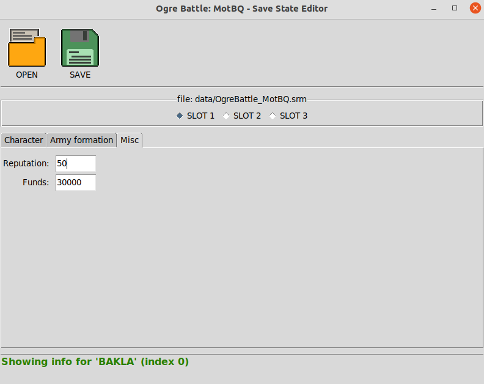

# ogrebattleHacking

Savestate hacking for "Ogre Battle - the March of the Black Queen": to modify the save states produced by a SNES emulator while playing "Ogre Battle - MotBQ".

It comes in 2 flavors:
 - a simple (and quite rough) GUI to view and modify the data
 - a simple CLI that can be used to script more complex tasks


## Build & Run

It's python...no build, just some requirements:
 * Python3
 * Tkinter 8.6 module (should be already distributed with Python3)

Then just run either `python3 guiviewer.py` or `python3 consoleviewer.py`!
Both scripts are inside the `./src` folder and must be run from inside that folder!


## Features

> :warning: There are no (or very few) safety belts: mind your doing when modifying a savestate...it can lead to a corrupted game (e.g., like assigning the class "Building" to a unit, or by deploying several opinion leaders).

### Modify character statistics

> :warning: When characters are assigned to a unit/group, then their statistics slightly change depending on the statistics of the unit leader...the statistics shown by this application are the raw statistics of the characters (aka the same statistics that are shown when the characters are not assigned to any group).

Through the GUI application it is possible to modify everything but the name of of the characters:


Through the CLI application everything can be changed. Use

```
usage: consoleviewer.py FILE show unit [-h] [-i INFO] UNIT_INDEX [UNIT_INDEX ...]

positional arguments:
  UNIT_INDEX

optional arguments:
  -h, --help            show this help message and exit
  -i INFO, --info INFO  leave empty to display all unit infos
```

to inspect some (or all) statistics of one or more characters or use

```
usage: consoleviewer.py FILE update unit [-h] UNIT_INDEX INFO VALUE

positional arguments:
  UNIT_INDEX
  INFO
  VALUE

optional arguments:
  -h, --help  show this help message and exit
```

to modify a specific statistic of a single character, where:

 - `UNIT_INDEX` is the index of the unit as saved inside the savestate. This number is how characters are stored inside the savestate and there is no easy way to fetch this number from the game itself. It is suggested to use the `consoleviewer.py [...] show [...]` command to infer the correct number, or just use `guiviewer.py` to check the number
 - `INFO` is the statistic that will be updated. See following table to get complete list.
 - `VALUE` is the new value to assign to `INFO`. The type of the input value depends on `INFO`. See following table.

| `INFO` | `VALUE` |
|:---:|:---:|
| `NAME`  | a string. Available names can be found inside `names.json` (under the keyword `"names"`) |
| `CLASS` | a string. Available classes can be found inside `classes.json` (under the keyword `"names"`) |
| `LVL`   | a number |
| `EXP`   | a number (should be in range `0 .. 99`) |
| `HP`    | a number (should be in range `0 .. 999`) |
| `STR`   | a number (should be in range `0 .. 255`) |
| `AGI`   | a number (should be in range `0 .. 255`) |
| `INT`   | a number (should be in range `0 .. 255`) |
| `CHA`   | a number (should be in range `0 .. 255`) |
| `ALI`   | a number (should be in range `0 .. 255`) |
| `LUK`   | a number (should be in range `0 .. 255`) |
| `COST`  | a number |
| `ITEM`  | a string. Available names can be found inside `items.json` (under the keyword `"names"`) |

### Modify generic data

Some generic data. For now:
 - army funds (goth)
 - reputation



```
usage: consoleviewer.py FILE show misc [-h] [-i INFO]

optional arguments:
  -h, --help            show this help message and exit
  -i INFO, --info INFO  leave empty to display all misc infos
```

```
usage: consoleviewer.py FILE update misc [-h] INFO VALUE

positional arguments:
  INFO
  VALUE

optional arguments:
  -h, --help  show this help message and exit
```

| `INFO` | `VALUE` |
|:---:|:---:|
| `MONEY`      | a number |
| `REPUTATION` | a number (should be in range `0 .. 100`) |
| `CHECKSUM`   | a number |


### Fix the checksum

With the CLI application it is also possible to autofix the checksum of the savestate (in case somebody is going to modify it with a raw hex editor):

```
usage: consoleviewer.py FILE fix-checksum [-h] [-d]

show/solve problems related to the checksum

optional arguments:
  -h, --help     show this help message and exit
  -d, --dry-run  show expected checksum but do not modify file
```


### Modify army composition

Not implemented yet.


### Modify inventory and tarot cards

Not implemented yet.
